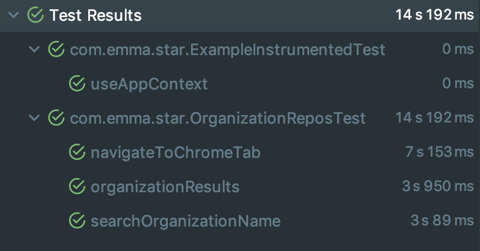

# Android - Github Organization's Starred Repositories 

An Android app which allows users to search for an organization's most starred repositories

## Getting Started

These instructions will get you a copy of the project up and running on your local machine for development and testing purposes.

## Getting Started

1. [Install Android Studio](https://developer.android.com/studio/install.html), if you don't already have it.
2. Download the sample.
2. Import the sample into Android Studio.
3. Build and run the sample.

## Running the tests

Unit Tests
Run the individual files from within Android Studio or
`./gradlew test`

Instrumentation Tests
`adb shell am instrument -w -r -e package com.emma.star -e debug false com.emma.star.test/androidx.test.runner.AndroidJUnitRunner`
